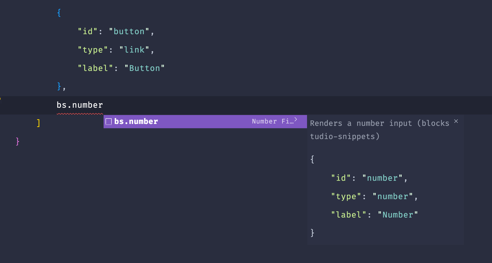

# Blockstudio Snippets

## Features

Describe specific features of your extension including screenshots of your extension in action. Image paths are relative to this README file.

For example if there is an image subfolder under your extension project workspace:

## Release Notes

Users appreciate release notes as you update your extension.

### 1.0.0

Initial release of Blockstudio Snippets

---

## How to use

To use this extension, navigate to a json file and type the shortcode prefix `bs.` followed by the field type.
So the shortcode will look like this: `bs.text`.

## For more information, bug reports or feature requests

- [Github](https://github.com/fiioonnn/bss)

**Have fun!**
